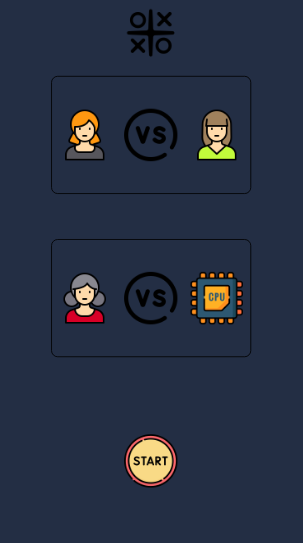
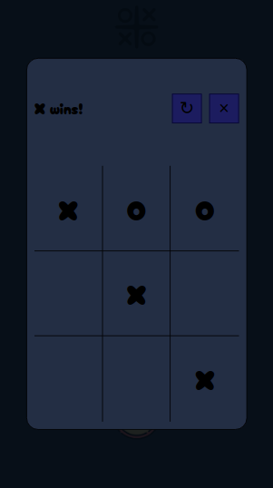

# Tic Tac Toe

This is my attempt at Project: [Tic Tac Toe](https://www.theodinproject.com/lessons/node-path-javascript-tic-tac-toe) of [The Odin Project's](https://www.theodinproject.com/) basic Javascript projects. It is a simple Tic-tac-toe (noughts and crosses) game playable in the browser.

## Skills demonstrated in this project

- JavaScript objects, factory functions and IIFEs.
- [Live page](nonines.github.io/Project-tic-tac-toe/)

## Screenshots

## Icon credits

- <a href="https://www.flaticon.com/free-icons/tic-tac-toe" title="tic tac toe icons">Tic tac toe icons created by zafdesign - Flaticon</a>
- <a href="https://www.flaticon.com/free-icons/start-button" title="start button icons">Start button icons created by Freepik - Flaticon</a>
- <a href="https://www.flaticon.com/free-icons/user-icon" title="user icon icons">User icon icons created by xnimrodx - Flaticon</a>
- <a href="https://www.flaticon.com/free-icons/vs" title="vs icons">Vs icons created by Freepik - Flaticon</a>
